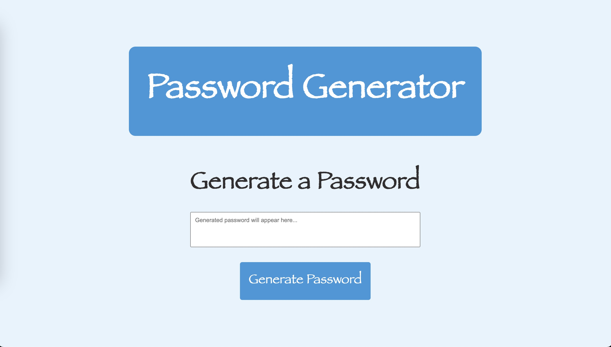

# Password Generator

*This is a simple web-based password generator. Users can specify the length of the password and choose to include lowercase letters, uppercase letters, numbers, and special characters.*

## How to Use

1. Open `index.html` in a web browser.
2. Enter the desired length of the password (between 8 and 128 characters).
3. Choose the character types to include.
4. Click the "Generate Password" button.
5. The generated password will appear in the designated area.

## Files and Structure

- `index.html`: HTML file containing the structure of the web page.
- `style.css`: External stylesheet for styling the web page.
- `script.js`: JavaScript file with functions for password generation.

## Author:  **JETNIK SYLA**   

## Contact

For inquiries or collaboration opportunities, please feel free to reach out to **Jetnik Syla:**

* #### **Email:** sjetnik@gmail.com

* #### **Phone:** + (1) 914-415-9578

* #### **GitHub Profile:** Jetnik Syla

## Project Screenshot

